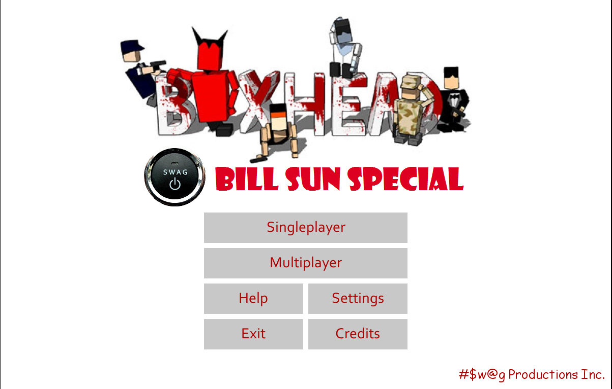
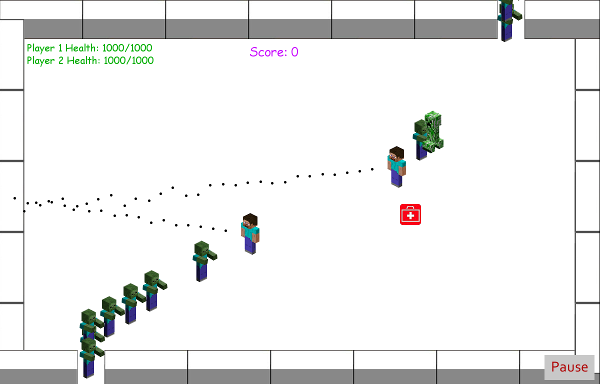
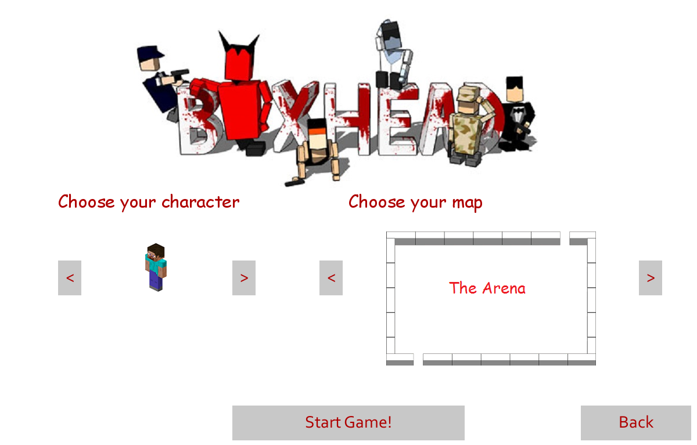
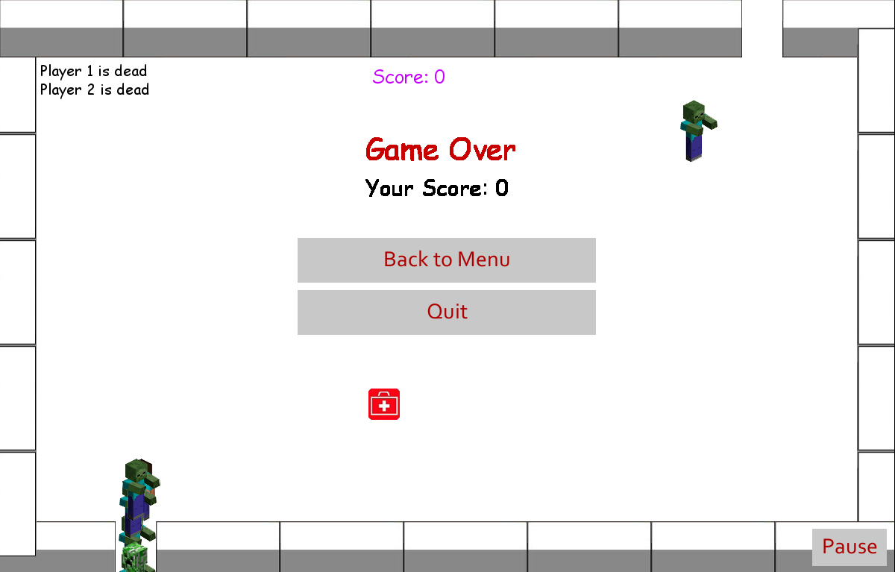

## Boxhead-Video-Game

This is the final project for the grade 11 computer programming course, which involved the design and building of a video game using Python and the Python library Pygame. This game is an attempt to recreate the well-known online video game Boxhead

### Screenshots

Home page:

Selection page:

Gameplay screen:

Game over:

